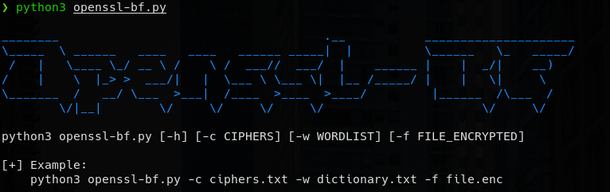
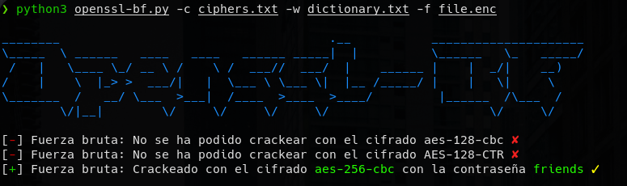

## Openssl-BruteForce

Python tool to bruteforce file encrypted with a cipherlist and a wordlist 

### Requeriments
-   OpenSSL
-   python libraries (pwntools)

### Usage

</img>

### Decrypt

</img>

